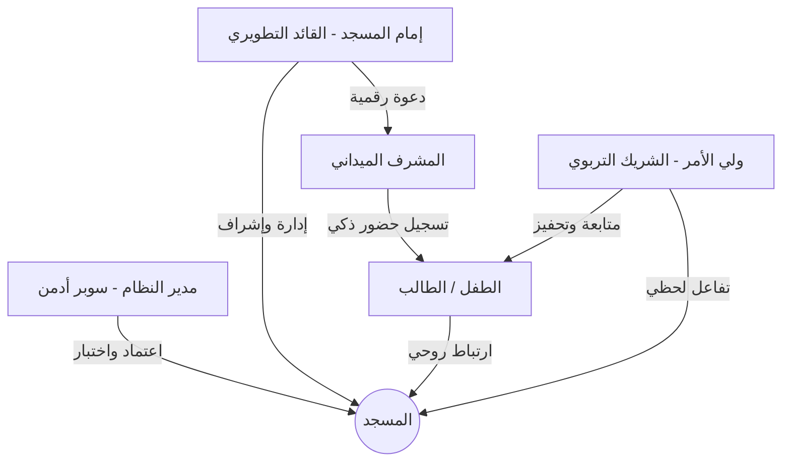

# صلاتي حياتي: رؤية استراتيجية لمنظومة رقمية تربوية متكاملة
## (نسخة العميل - دراسة شاملة لربط الأدوار وتجربة المستخدم)

هذه الوثيقة دراسة **كاملة متكاملة**:
- ربط الأدوار والرؤية الاستراتيجية (الأقسام 1–5).
- **مسجد أساسي ومساجد ثانوية** (5 مكرر)، **التحديثات المباشرة Realtime** (6)، **الإشعارات** (6 مكرر)، **مواقيت الصلاة وطلب التسجيل** (6 مكرر 2)، **تدفق المشرف** (6 مكرر 3).
- **ما هو قادم** تفصيلاً — صغيراً وكبيراً — مع الأولويات (القسم 7).
- **تطوير الدراسة** (8) وال**خطة النهائية المرنة** (9 مكرر).

---

## 1. الملخص التنفيذي
يهدف تطبيق **"صلاتي حياتي"** إلى سد الفجوة بين المسجد والبيت من خلال نظام رقمي ذكي يربط الإمام والمشرف وأولياء الأمور في حلقة متصلة. هذه الدراسة تستعرض كيف سيتحول التطبيق من "أداة إدارية" إلى **"منصة تربوية ملهمة"** تضمن الانضباط، تعزز الشفافية، وتخلق تجربة مستخدم لا تُنسى.

---

## 2. استراتيجية ربط الأدوار (Ecosystem Mapping)
لقد تم تصميم المنظومة لتعمل بتناغم تام، حيث يغذي كل دور الطرف الآخر بالبيانات والتحفيز:

### القيمة المضافة لكل دور:
-   **الإمام:** يمتلك لوحة تحكم شاملة لقياس أداء المسجد تربوياً وجذب المصلين الصغار.
-   **المشرف:** واجهة عمل سريعة جداً (تحضير يقل عن 3 ثوانٍ للطفل الواحد) لضمان عدم تعطيل وقت الصلاة.
-   **ولي الأمر:** الطمأنينة الكاملة عبر إشعارات فورية وتقارير دقيقة تعينه على توجيه أبنائه.

---

## 3. تجربة المستخدم الابتكارية (The WOW Experience)
لضمان تميز التطبيق في السوق، تم دمج عناصر **"التحفيز البصري"** و**"التفاعل الشعوري"**:

### أ. نظام "النبض الفوري" (Attendance Pulse)
بمجرد مسح رمز الـ QR في المسجد، يرسل النظام "نبضاً" لهاتف الأب واهتزازاً خفيفاً للمشرف، مما يخلق رابطاً شعورياً بأن "الاتصال تم".

### ب. الهوية البصرية الحيوية (Dynamic Spirit Aura)
الملف الشخصي للطفل ليس ساكناً؛ بل يتغير لونه وتوهجه بناءً على "المعدل الإيماني". الطفل المواظب يتوهج ملفه باللون الذهبي أو الأزرق السماوي، مما يشجع الأطفال على "المنافسة البصرية".

### ج. جسر التواصل الصامت (The Silent Connection)
إمكانية إرسال "رسائل تشجيع سريعة" بضغطة واحدة من المشرف للأب (مثل: "تلاوته اليوم رائعة")، مما يحول العلاقة مع المسجد من رسمية إلى علاقة ودية تربوية.

---

## 4. استمرارية التشغيل ومعالجة الحالات الاستثنائية (Resilience)
لقد درسنا في هذه النسخة أعمق التفصيلات لضمان عدم توقف النظام تحت أي ظرف:

| الحالة المحتملة | الحل البرمجي والتشغيلي المحكم |
| :--- | :--- |
| **انقطاع الإنترنت في المسجد** | يعمل التطبيق بـ "الوضع المحلي" (Local Storage) الذي يجمع البيانات ويقوم بمزامنتها تلقائياً فور توفر الشبكة دون ضياع أي سجل. |
| **فقدان بطاقة الـ QR** | يوفر النظام 3 بدائل: البحث الذكي بالاسم، التحضير عبر رقم الهوية، أو الضغط المباشر من قائمة الفصل/المجموعة. |
| **تغيير المسجد أو السفر** | ملف الطفل "عالمي"؛ يمكن لولي الأمر ربط الطفل بمسجد أساسي ومساجد ثانوية (انظر القسم 6 مكرر) مع الحفاظ على النقاط والسجل. |

---

## 5. البناء التقني والأمن الرقمي (Simplified Tech Specs)
بعيداً عن التعقيد، تضمن المنظومة ما يلي:
-   **خصوصية مطلقة:** لا يمكن لأي مشرف رؤية بيانات طفل من خارج مسجده، ولا يمكن لأي أب رؤية بيانات أطفال خارج عائلته (نظام RLS المتقدم).
-   **سرعة الاستجابة:** استخدام خوادم سحابية حديثة تضمن وصول التنبيهات في جزء من الثانية.
-   **التوافق:** يعمل التطبيق على جميع أنواع الهواتف (Android & iOS) بأداء سلس جداً وبطارية منخفضة الاستهلاك.

---

## 5 مكرر. مسجد أساسي ومساجد ثانوية (Primary + Secondary Mosques)

الفكرة: للطفل **مسجد أساسي** واحد (مكان الانتظام) و**مساجد ثانوية** (مثلاً اثنان: إجازة، سفر) لربط الحضور عند تغيير المكان.

### هل المسجد الثانوي يكون مسجّلاً في التطبيق أم اسم فقط؟

| الخيار | الوصف | الإيجابيات | السلبيات |
|--------|--------|------------|----------|
| **مسجّل في التطبيق** | المسجد الثانوي نفسه موجود في جدول `mosques` ومعتمد، وولي الأمر يربط الطفل به بكود المسجد. نوع الربط في `mosque_children.type` = `primary` أو `secondary`. | مصدر حقيقة واحد، تحضير ونقاط موحّدة، لا ازدواجية. | المسجد (مثلاً مسجد إجازة) يجب أن يكون قد سجّل في التطبيق من إمامه. |
| **اسم فقط** | المسجد الثانوي غير مسجّل؛ ولي الأمر يكتب "اسم المسجد" (نص) وربما المدينة. الحضور يُسجّل "منزل" أو تحت مسجد أساسي مع ملاحظة. | مرونة لأي مكان بدون اشتراط تسجيل المسجد. | تعقيد في التقارير، وربما لا تحضير فعلي من ذلك المسجد عبر التطبيق. |

**توصية للنسخة الحالية:** الاعتماد على **مسجد ثانوي مسجّل في التطبيق** (نفس الجدول `mosques`، ربط عبر `mosque_children` مع `type = secondary`)، مع حدّ مثلاً مسجد أساسي + مسجدان ثانويان لكل طفل. إذا لاحقاً ظهرت حاجة لـ "اسم فقط" (مسجد غير مسجّل) يمكن إضافة حقل اختياري أو جدول بسيط لأسماء مساجد "مرجعية" دون ربط تسجيل حضور كامل.

---

## 6. التحديثات المباشرة (Realtime — مثل Sockets)

### لماذا نحتاجها؟
حتى تصبح **التغييرات مباشرة** دون الحاجة لتحديث الصفحة يدوياً:
- **ولي الأمر:** يرى حضور ابنه فور تسجيل المشرف (بدون إعادة فتح التطبيق).
- **الإمام/المشرف:** يرى طلب تصحيح جديد أو ملاحظة واردة فوراً.
- **الإمام:** يرى موافقة السوبر أدمن على مسجده دون إعادة الدخول.
- **سوبر أدمن:** (اختياري) رؤية طلبات جديدة فور وصولها.

### الخيار التقني الموصى به: Supabase Realtime (Postgres Changes)
- لا حاجة لخادم WebSockets منفصل؛ Supabase يوفّر **Postgres Changes** عبر قنوات (Channels).
- التطبيق يشترك (subscribe) بجدول أو بصفوف محددة، وأي `INSERT`/`UPDATE`/`DELETE` يصل فوراً كـ event.
- متوافق مع Flutter عبر حزمة `supabase_flutter` (الموجودة في المشروع).

### الجداول والحدثات المطلوبة

| الجدول / الكيان | الحدث | من يهمّه | مكان الاستماع في التطبيق |
|-----------------|-------|----------|---------------------------|
| `attendance` | INSERT, UPDATE | ولي الأمر | الشاشة الرئيسية (حضور اليوم)، تفاصيل الطفل |
| `mosques` | UPDATE (status) | إمام | بوابة المسجد، لوحة المشرف (عند الموافقة) |
| `correction_requests` | INSERT, UPDATE | إمام/مشرف | لوحة المشرف (قسم التصحيحات) |
| `notes` | INSERT | ولي الأمر | الرئيسية أو تفاصيل الطفل (ملاحظات المشرف) |
| `mosques` (INSERT = طلب جديد) | INSERT, UPDATE | سوبر أدمن | شاشة طلبات المساجد |

### هل يكفي الـ migration لوحدها؟
**لا.** الـ migration (`007_enable_realtime_publication.sql`) يفعّل فقط إمكانية بث التغييرات من قاعدة البيانات. حتى تصبح **التغييرات مباشرة** في التطبيق يجب كتابة **كود Flutter**:
- إنشاء خدمة (مثلاً `RealtimeService`) تشترك في قنوات Supabase وتستمع لـ `postgres_changes`.
- في كل شاشة معنية: عند استلام الحدث → إعادة جلب البيانات أو تحديث الـ state.

بدون هذا الكود، التطبيق **لا** يتحدّث تلقائياً بعد الـ migration.

### خطوات التنفيذ (مختصر)
1. **في Supabase:** تم إضافة الجداول إلى منشور Realtime عبر migration `007_enable_realtime_publication.sql` (attendance, mosques, correction_requests, notes). طلبات المساجد = تحديثات على جدول `mosques` (status).
2. **في Flutter:** إنشاء خدمة (مثلاً `RealtimeService`) تُنشئ قناة وتستمع لـ `postgres_changes` (event: INSERT/UPDATE، schema: public، table: attendance ثم غيرها).
3. **ربط بالواجهة:** في الشاشة الرئيسية لولي الأمر: عند استلام حدث على `attendance` → إعادة جلب "حضور اليوم" أو تحديث الـ state. نفس الفكرة لشاشات الإمام والإدارة.

### ملاحظات
- **الأمان:** Realtime يطبّق RLS؛ المستخدم يرى فقط الصفوف التي يسمح له بقراءتها.
- **البطارية والاستهلاك:** الاشتراك يكون عند فتح الشاشة المعنية ويُلغى عند الخروج (dispose) لتقليل الاستهلاك.
- **الاحتياط:** إن فشل الاتصال المباشر، يبقى الاعتماد على السحب اليدوي (pull-to-refresh) أو إعادة فتح الشاشة كما هو حالي.

---

## 6 مكرر. الإشعارات (Notifications) — توثيق استباقي

حتى لا نترك موضوع الإشعارات مبعثراً، هذا قسم مرجعي يُحدَّث عند التنفيذ.

### الأهداف
- إعلام ولي الأمر فور تسجيل حضور ابنه (النبض الفوري).
- إعلام الإمام بموافقة السوبر أدمن على مسجده.
- إعلام المشرف/الإمام بطلب تصحيح أو ملاحظة جديدة (إن وُجدت).
- إعلام ولي الأمر بملاحظة من المشرف أو نتيجة طلب تصحيح.

### التقنيات
- **FCM (Firebase Cloud Messaging):** للإشعارات التي تصل حتى عندما التطبيق مغلق أو في الخلفية. الخدمة الحالية `NotificationService` تحفظ الـ token وتشترك في مواضيع (مثلاً `mosque_<id>`). يُستكمَل لاحقاً: إرسال من الخادم (أو Edge Function) عند حدث معيّن (حضور، موافقة، إلخ).
- **Realtime (داخل التطبيق):** عند فتح الشاشة، التحديث المباشر يغني عن إشعار داخل التطبيق؛ لكن للإشعار "على الجهاز" (شريط الإشعارات) نحتاج FCM أو مشابه.

### متى نرسل (جدول مرجعي)
| الحدث | المُستقبِل | النوع المقترح |
|-------|------------|----------------|
| تسجيل حضور طفل | ولي الأمر | FCM (موضوع الطفل أو العائلة) |
| موافقة سوبر أدمن على مسجد | إمام المسجد | FCM |
| طلب تصحيح جديد | مشرف/إمام المسجد | FCM أو Realtime حسب التنفيذ |
| ملاحظة من المشرف للطفل | ولي الأمر | FCM |
| طلب تسجيل صلاة من ولي الأمر (انظر 6 مكرر 2) | مشرف/إمام | FCM أو Realtime |

### ما هو موجود حالياً
- طلب إذن الإشعارات، حفظ FCM token في `users`، الاشتراك في موضوع المسجد `mosque_<id>`، واستماع الرسائل في الواجهة الأمامية والخلفية. يبقى ربط **إرسال** الإشعار من الخادم/Edge عند حدوث الأحداث أعلاه.

---

## 6 مكرر 2. مواقيت الصلاة وطلب التسجيل (من الأذان ولمدة ساعة)

### القاعدة المطلوبة
- **لا يُسجّل الحضور لصلاة قبل وقت الأذان.**  
- **يُفعَّل التسجيل من وقت الأذان ولمدة ساعة** (قابل للتعديل، مثلاً ساعة واحدة بعد الأذان). بعدها يُعتبر الوقت "منتهياً" للتسجيل العادي.

### التطبيق في الكود
- عند تسجيل الحضور (من واجهة المشرف): التحقق من `now` بالنسبة لموعد أذان الصلاة المعنية؛ إن كان قبل الأذان → رفض مع رسالة واضحة. إن كان بعد الأذان بأكثر من المدة المسموحة (مثلاً ساعة) → يمكن رفض أو السماح "تأخير" حسب السياسة (انظر طلب التسجيل أدناه).
- مصدر مواقيت الصلاة: حساب محلي (حزمة مواقيت) أو API حسب ما هو معتمد في المشروع.

### طلب تسجيل صلاة من ولي الأمر
للحالات: ولي الأمر صلّى بالبيت أو المشرف نسي أو المشرف تأخر لأكثر من الساعة — نسمح **بطلب تسجيل صلاة** من ولي الأمر للمشرف/الإمام:
- ولي الأمر يختار الطفل + الصلاة + التاريخ ويرسل "طلب تسجيل".
- المشرف/الإمام يرى الطلب ويستطيع **التسجيل نيابةً** (أو الموافقة فتح سجل حضور) أو الرفض.
- يمكن استخدام جدول **correction_requests** لنفس الغرض (طلب تصحيح = طلب إضافة حضور) أو إنشاء جدول مخصّص مثل `attendance_requests` لتمييز "طلب إضافة حضور" عن "طلب تصحيح خطأ". يُحدَّد عند التنفيذ.

---

## 6 مكرر 3. تدفق المشرف وحسابه (هل يدخل ويلاقي كل شيء جاهز؟)

- **المشرف له دور مستقل في التطبيق:** في جدول `users` يوجد الآن دور `supervisor` (أقل من الإمام). عند **التسجيل** يختار المستخدم "مشرف" فيصبح `users.role = supervisor`.
- **لا يوجد "حساب ينشئه الإمام"**؛ المشرف يملك حسابه ويربط **نفسه** بالمسجد بإدخال **كود الدعوة** من بوابة المسجد (لا يظهر له زر "إنشاء مسجد"، فقط "انضم بكوْد").
- **الدخول:** بعد تسجيل الدخول يُوجّه إلى **بوابة المسجد** ثم إن كان قد انضم سابقاً لمسجد معتمد → **لوحة المشرف** مباشرة. يجد قائمة الطلاب والتحضير جاهزة.
- **إن كان المشرف أيضاً ولي أمر:** يمكن لاحقاً دعم حساب يجمع الاثنين (مثلاً تبديل الهوية)؛ حالياً الأدوار منفصلة عند التسجيل (ولي أمر / إمام / مشرف).

---

## 7. ما هو قادم — تفصيل لكل صغير وكبير

### مرجع التدفقات والأدوار
- التوجيه حسب الدور: انظر `docs/app_flows_simple.md`.
- دورة الحضور والاختبار اليدوي: انظر `docs/checklist_attendance_lifecycle.md`.
- ترتيب الخطوات القادمة: انظر `docs/roadmap_next.md`.

### أ. مكتمل أو شبه مكتمل (ربط فقط)
| البند | الوصف | الحالة |
|-------|--------|--------|
| توجيه الأدوار | سوبر أدمن → طلبات، إمام → بوابة/لوحة، ولي أمر → الرئيسية | ✅ |
| دورة الحضور | تحضير (QR/رقم/قائمة) → ظهور "حضور اليوم" لولي الأمر | ✅ (مع التحقق من الـ checklist) |
| كود المسجد وكود الدعوة | عرضهما في لوحة المشرف مع نسخ/مشاركة | ✅ |

### ب. تحسينات قصيرة (صغيرة ومتوسطة)
| البند | الوصف | الأولوية |
|-------|--------|----------|
| تفريق الإمام عن المشرف في الواجهة | للمدير (owner) فقط: قسم "المشرفون" / كود الدعوة؛ للمشرف (supervisor) إخفاء إدارة المشرفين | متوسطة |
| تحديث الحضور مباشرة لولي الأمر | Realtime على `attendance` في الشاشة الرئيسية (انظر القسم 6) | عالية |
| تحديث موافقة المسجد للإمام | Realtime على `mosques` (status) في بوابة المسجد | عالية |
| **تحقق مواقيت الصلاة** | منع تسجيل الحضور قبل الأذان؛ السماح من الأذان ولمدة ساعة (انظر 6 مكرر 2) | عالية |
| Skeleton / تحميل أنيق | عرض هيكل تحميل بدل شاشة فارغة في الرئيسية وحضور اليوم | منخفضة |

### ج. ميزات لاحقة (كبيرة)
| البند | الوصف | التبعيات |
|-------|--------|-----------|
| طلبات التصحيح (Corrections) | ولي الأمر يرفع طلب ← إمام/مشرف يراجعه (جدول + RLS جاهز؛ بقي الشاشات والربط) | Realtime اختياري لظهور الطلبات الجديدة للمشرف |
| الملاحظات (Notes) | مشرف/إمام يرسل ملاحظة لولي الأمر (جدول موجود؛ بقي الواجهة والربط) | Realtime لظهور الملاحظة فوراً عند ولي الأمر |
| **طلب تسجيل صلاة من ولي الأمر** | ولي الأمر يطلب تسجيل صلاة (نسي المشرف / تأخر / صلاة في البيت) ← مشرف يوافق ويسجّل (انظر 6 مكرر 2) | قد يُربط بـ correction_requests أو جدول مخصّص |
| إدارة المشرفين | قائمة مشرفي المسجد، إزالة مشرف (للمدير فقط) | تفريق owner vs supervisor في الواجهة |
| مسجد أساسي + ثانويان | حدّ مسجد واحد أساسي + اثنان ثانويان لكل طفل، وواجهة ربط واضحة (انظر 5 مكرر) | الداتابيس جاهزة (mosque_children.type) |
| الوضع المحلي والمزامنة (Offline) | حفظ محلي للحضور وإعادة مزامنة عند الاتصال | تصميم تخزين محلي + سياسة حل التعارضات |
| النبض الفوري (Attendance Pulse) | إشعار/اهتزاز فوري عند تسجيل الحضور (للمشرف و/أو ولي الأمر) | Realtime + FCM أو Realtime فقط داخل التطبيق |
| الهالة الديناميكية (Dynamic Spirit Aura) | لون/توهج الملف الشخصي للطفل حسب المعدل الإيماني | حساب المعدل من الحضور/النقاط + ربط بالـ UI |
| رسائل تشجيع سريعة | رسالة جاهزة من المشرف لولي الأمر ("تلاوته اليوم رائعة") | يمكن ربطها بجدول `notes` أو نوع رسالة مخصّص |

### د. عناصر صغيرة (تحسينات نصية وسلوكية)
- توحيد العبارات (مثلاً "إمام (مدير المسجد)" في كل الواجهات).
- رسائل خطأ واضحة عند فشل الربط (كود مسجد خاطئ، انقطاع شبكة).
- Pull-to-refresh في قوائم الحضور والطلبات كبديل حتى اكتمال Realtime.

---

## 8. تطوير هذه الدراسة (كيف نحدّث الوثيقة)

- **نسخة واحدة مرجعية:** هذا الملف (`study_roles_integration.md`) هو المرجع الموحّد للرؤية الاستراتيجية + الربط التقني + ما هو قادم + Realtime.
- **التحديث الدوري:** عند إنجاز بند من "ما هو قادم" → نقله إلى "مكتمل" في القسم 7، مع إضافة تاريخ أو رقم إصدار صغير إن رُغب.
- **الربط بالوثائق الأخرى:**  
  - `roadmap_next.md`: تفاصيل خطوات التنفيذ القصيرة.  
  - `app_flows_simple.md`: تدفقات المستخدم.  
  - `checklist_attendance_lifecycle.md`: اختبار دورة الحضور.  
  عند تغيير سلوك التطبيق يُحدَّث الملف المناسب ويُذكر هنا إن لزم.
- **قسم Realtime:** عند تنفيذ الاشتراكات الفعلية (Supabase Realtime)، يُحدَّث الجدول في القسم 6 بأسماء القنوات أو الـ streams المستخدمة في الكود ومراجع الملفات (مثلاً `lib/.../realtime_service.dart`).

---

## 9 مكرر. الخطة النهائية المرنة — وما قد فاتنا

هذا القسم يجمع الرؤية النهائية ويُبقِيها **قابلة للتغيير والمرونة والتوسعة**.

### الأولويات العملية (ترتيب تنفيذ مقترح)
1. **التحقق من دورة الحضور** (checklist) ثم **Realtime** (كود Flutter بعد الـ migration) للحضور وموافقة المسجد.
2. **تحقق مواقيت الصلاة** (من الأذان ولمدة ساعة) في واجهة التحضير.
3. **الإشعارات:** ربط إرسال FCM من الخادم/Edge عند الأحداث (حضور، موافقة، إلخ).
4. التصحيحات والملاحظات ثم **طلب تسجيل صلاة من ولي الأمر** ثم إدارة المشرفين.
5. مسجد أساسي + ثانويان (حدّ وواجهة) ثم Offline ثم النبض الفوري والهالة.

### ما قد يكون فاتنا (قائمة مراجعة)
- [ ] **مواقيت الصلاة:** منع التسجيل قبل الأذان + نافذة ساعة بعد الأذان — مُدرج في 6 مكرر 2 و 7.
- [ ] **طلب تسجيل من ولي الأمر** عند نسيان المشرف أو التأخر — مُدرج.
- [ ] **تدفق المشرف:** حساب خاص، انضمام بكود الدعوة، دخول ولوحة جاهزة — مُدرج في 6 مكرر 3.
- [ ] **الإشعارات:** توثيق استباقي ومتى نرسل — مُدرج في 6 مكرر.
- [ ] **مسجد ثانوي:** مسجّل في التطبيق vs اسم فقط — مُدرج في 5 مكرر.
- [ ] **تبديل الهوية (أب ↔ مشرف):** تم إسقاطه من الأولويات الحالية (لا داعي له حسب الطلب).

### مرونة الوثيقة
- أي بند في "ما هو قادم" يمكن تأجيله أو تغيير أولويته دون كسر البنية.
- الأقسام "مكرر" (5 مكرر، 6 مكرر، 6 مكرر 2، 6 مكرر 3) قابلة للتوسعة: إضافة فقرات أو جداول عند ظهور تفاصيل جديدة.
- عند تنفيذ ميزة، نقلها إلى "مكتمل" وتحديث "ما قد فاتنا" إن لزم.

---

## 9. الخاتمة والتوصية الاستراتيجية
هذه الدراسة ليست مجرد خطة تقنية، بل هي **تأسيس لمنهج حياة**. نوصي بالبدء الفوري في تنفيذ "محرك التنبيهات الذكي" كنقطة انطلاق لخلق الارتباط الأول والوثيق مع أولياء الأمور، يليه نظام التحفيز البصري (الهالات الضوئية) لضمان تفاعل الأطفال.

**الأولوية العملية الحالية:** استكمال ربط دورة الحضور (والتحقق منها بالـ checklist)، ثم **تفعيل التحديثات المباشرة (Realtime)** للحضور وموافقة المسجد حتى تصبح التغييرات مباشرة للمستخدم دون انتظار. بعدها: عرض التصحيحات والملاحظات ثم إدارة المشرفين ثم Offline حسب الأولوية.

**المرحلة القادمة:** بناء النماذج الأولية للواجهات (UI Flow) واختبار "النبض الفوري" ميدانياً، مع إبقاء هذه الوثيقة محدّثة عند كل تطوّر.
